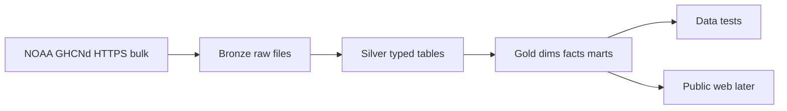

# Architecture — Climate Record Platform

**Last updated:** 2026-07-20

---

## High-level flow

---

## Medallion

| Layer | Contents | Location |
|-------|----------|----------|
| **Bronze** | Immutable lands: station list, inventory, per-station daily `.csv`/`.dly` as fetched | `data/bronze/` |
| **Silver** | Parsed observations + flags; cleaned station attributes | `data/silver/` (Phase 2) |
| **Gold** | Dimensional model + analytic marts | `data/gold/` + dbt (Phase 3) |

---

## Source system

| Artifact | URL pattern |
|----------|-------------|
| Readme | `https://www.ncei.noaa.gov/pub/data/ghcn/daily/readme.txt` |
| Stations | `.../ghcnd-stations.txt` |
| Inventory | `.../ghcnd-inventory.txt` |
| Per-station daily | `.../all/{STATION_ID}.csv.gz` or `.dly` under `all/` |

Prefer **by-station CSV** where available for simpler Phase 1; fall back to `.dly` fixed-width if needed.

---

## Target gold model (Phase 3 sketch)

| Table | Grain |
|-------|--------|
| `dim_station` | One current row per station; SCD2 history table if relocations tracked |
| `dim_date` | date_key |
| `dim_element` | element code (TMAX, TMIN, PRCP, …) |
| `fact_observation_daily` | station + date + element |
| `mart_degree_days` | station + date or month (HDD/CDD) |
| `mart_freeze_season` | station + year |
| `mart_extremes` | station + year/month + threshold set |
| `mart_coverage_quality` | station + year (completeness) |

---

## Deploy / run path

1. Developer machine (or home lab later): Python ingest on schedule  
2. Transform: local DuckDB/dbt  
3. Publish: static JSON/Parquet subset → Dunleavy deploy list  

Secrets: none for public GHCNd. YouTube/other APIs N/A.

---

## Out of scope

- Operational weather **forecasts** as core product  
- Work-window / crew scheduling  
- Political campaign framing  
