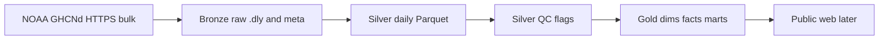

# Architecture — Climate Record Platform

**Last updated:** 2026-07-21

---

## High-level flow



**Rule of thumb**

| Layer | Job |
|-------|-----|
| **Bronze** | Land source files unchanged |
| **Silver** | Parse into typed rows; keep NOAA flags |
| **Silver QC** | Label rows (`qc_pass` / `qc_reasons`); do not delete |
| **Gold** | Dims, facts, marts using **qc_pass only** |

---

## Medallion paths

| Layer | Contents | Location |
|-------|----------|----------|
| **Bronze meta** | `ghcnd-stations.txt`, `ghcnd-inventory.txt`, `readme.txt` | `data/bronze/meta/` |
| **Bronze stations** | Per-station NOAA `.dly` (fixed-width daily history) | `data/bronze/stations/` |
| **Silver** | Parsed daily rows (TMAX/TMIN/PRCP by default) | `data/silver/stations/*.parquet` |
| **Silver QC** | Same rows + `qc_pass`, `qc_reasons` | `data/silver/stations_qc/*.parquet` |
| **Gold dims** | `dim_station` | `data/gold/dims/` |
| **Gold facts** | `fact_observation_daily` | `data/gold/facts/` |
| **Gold marts** | Monthly climate, HDD/CDD, yearly coverage | `data/gold/marts/` |
| **Run manifests** | Pull/build metadata | `data/meta/` |

Large payloads under `data/` are gitignored; code and docs are not.

---

## Source system (NOAA GHCNd)

| Artifact | URL pattern |
|----------|-------------|
| Readme | `https://www.ncei.noaa.gov/pub/data/ghcn/daily/readme.txt` |
| Stations | `.../ghcnd-stations.txt` |
| Inventory | `.../ghcnd-inventory.txt` |
| Per-station daily | `.../all/{STATION_ID}.dly` |

### What a `.dly` file is

- **One file** = one station (filename = station ID).  
- **One line** = one year-month + one element (e.g. PRCP), with up to **31 day slots** packed fixed-width.  
- Values use NOAA sentinels (`-9999` missing) and scale (e.g. TMAX tenths of °C).  
- Silver explodes lines into **one row per calendar day + element**.

### Station selection (bronze download)

Default CLI behavior (`download_station_days`):

- States: SC, NC, GA  
- Prefixes: **USW** (first-order / often airport), **USC** (coop long records)  
- Inventory must include **TMAX, TMIN, PRCP** with overlapping span ≥ 50 years  
- Optional round-robin **state balance**  
- `--list-only` previews picks without download  

---

## Code map

| Module | Role |
|--------|------|
| `src/ingest/download_ghcnd_meta.py` | Bronze meta files |
| `src/ingest/download_station_days.py` | Bronze `.dly` sample |
| `src/transform/parse_dly.py` | Fixed-width parse helpers |
| `src/transform/bronze_to_silver.py` | Bronze → silver Parquet |
| `src/transform/silver_quality_check.py` | Profile min/max, missing, dups |
| `src/transform/apply_qc.py` | Row QC flags → `stations_qc` |
| `src/transform/export_qc_fails.py` | CSV export of fails for review |
| `src/transform/silver_to_gold.py` | Gold dims / facts / marts |
| `src/common/paths.py` | Shared directories + GHCNd base URL |
| `src/common/http.py` | Download helper (skip if exists) |

---

## Silver row shape

| Column | Meaning |
|--------|---------|
| `station_id` | e.g. `USW00013872` |
| `date` | Calendar date |
| `element` | TMAX, TMIN, PRCP, … |
| `value_raw` | NOAA integer (or null if missing) |
| `value` | Scaled (e.g. °C, mm) |
| `unit` | `C`, `mm`, … |
| `mflag` / `qflag` / `sflag` | NOAA measurement / quality / source flags |
| `is_missing` | True if source was `-9999` |

After QC, also:

| Column | Meaning |
|--------|---------|
| `qc_pass` | Safe for gold products |
| `qc_reasons` | Comma-separated fail codes, or null if pass |

### QC rules (default)

| Code | Fail when |
|------|-----------|
| `missing` | `is_missing` |
| `qflag` | NOAA quality flag present |
| `range_temp` | TMAX/TMIN outside **[−40, 55] °C** (catches archive garbage; real ~40 °C heat still passes) |
| `range_prcp` | PRCP &lt; 0 or &gt; 500 mm |
| `tmax_lt_tmin` | Same day TMAX &lt; TMIN (both marked) |

Silver QC **keeps** failed rows for audit. Gold **reads only** `qc_pass == True`.

---

## Gold model (v1 shipped)

| Table | Grain | Notes |
|-------|--------|--------|
| `dim_station` | station_id | Name, state, lat/lon, elev, network prefix |
| `fact_observation_daily` | station + date + element | qc_pass only |
| `mart_monthly_climate` | station + year + month | avg TMAX/TMIN, total PRCP, day counts |
| `mart_degree_days_monthly` | station + year + month | HDD/CDD sums |
| `mart_coverage_yearly` | station + year + element | n_obs / days_in_year |

### Degree-day method (documented)

On days with **both** TMAX and TMIN passing QC:

```text
tavg_c ≈ (TMAX + TMIN) / 2
HDD = max(0, base_c - tavg_c)     default base_c = 18  (~65°F-style)
CDD = max(0, tavg_c - base_c)
```

Monthly marts **sum** daily HDD/CDD. Method is simple and explicit — not a full NCEI operational product.

### Still planned

- `mart_freeze_season`, extremes rates  
- SCD2 on stations if history warrants  
- dbt + DuckDB models/tests over the same logic  

---

## Run path (developer machine)

```powershell
cd C:\Users\seand\GitProjects\ClimateRecordPlatform
.\.venv\Scripts\Activate.ps1
pip install -r requirements.txt

# Bronze
python -m src.ingest.download_ghcnd_meta
python -m src.ingest.download_station_days --states SC,NC,GA --max-stations 15 --list-only
python -m src.ingest.download_station_days --states SC,NC,GA --max-stations 15

# Silver
python -m src.transform.bronze_to_silver --from-manifest

# QC
python -m src.transform.silver_quality_check
python -m src.transform.apply_qc --all
python -m src.transform.export_qc_fails
python -m src.transform.export_qc_fails --reason range_temp

# Gold
python -m src.transform.silver_to_gold
```

Secrets: **none** for public GHCNd.

Later: schedule on home lab; publish Parquet/JSON subset to Dunleavy.

---

## Out of scope

- Operational weather **forecasts** as core product  
- Work-window / crew scheduling  
- Political campaign framing  
