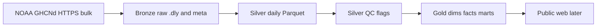
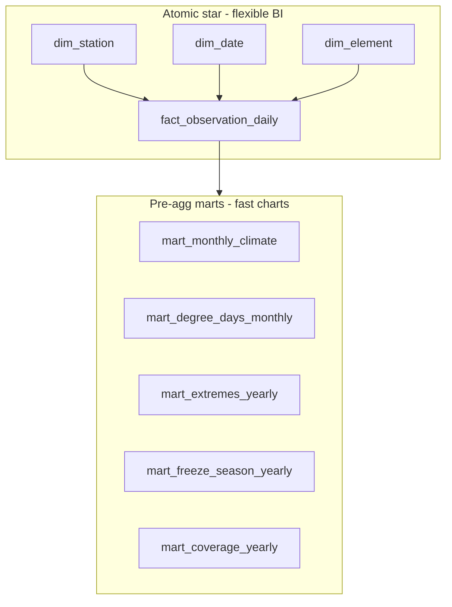

# Architecture — Climate Record Platform

**Last updated:** 2026-07-21 (star schema + viz path)

---

## High-level flow



**Rule of thumb**

| Layer | Job |
|-------|-----|
| **Bronze** | Land source files unchanged |
| **Silver** | Parse into typed rows; keep NOAA flags |
| **Silver QC** | Label rows (`qc_pass` / `qc_reasons`); do not delete |
| **Gold** | Dims, facts, marts using **qc_pass only** |

---

## Medallion paths

| Layer | Contents | Location |
|-------|----------|----------|
| **Bronze meta** | `ghcnd-stations.txt`, `ghcnd-inventory.txt`, `readme.txt` | `data/bronze/meta/` |
| **Bronze stations** | Per-station NOAA `.dly` (fixed-width daily history) | `data/bronze/stations/` |
| **Silver** | Parsed daily rows (TMAX/TMIN/PRCP by default) | `data/silver/stations/*.parquet` |
| **Silver QC** | Same rows + `qc_pass`, `qc_reasons` | `data/silver/stations_qc/*.parquet` |
| **Gold dims** | `dim_station` | `data/gold/dims/` |
| **Gold facts** | `fact_observation_daily` | `data/gold/facts/` |
| **Gold marts** | Monthly climate, HDD/CDD, yearly coverage | `data/gold/marts/` |
| **Run manifests** | Pull/build metadata | `data/meta/` |

Large payloads under `data/` are gitignored; code and docs are not.

---

## Source system (NOAA GHCNd)

| Artifact | URL pattern |
|----------|-------------|
| Readme | `https://www.ncei.noaa.gov/pub/data/ghcn/daily/readme.txt` |
| Stations | `.../ghcnd-stations.txt` |
| Inventory | `.../ghcnd-inventory.txt` |
| Per-station daily | `.../all/{STATION_ID}.dly` |

### What a `.dly` file is

- **One file** = one station (filename = station ID).  
- **One line** = one year-month + one element (e.g. PRCP), with up to **31 day slots** packed fixed-width.  
- Values use NOAA sentinels (`-9999` missing) and scale (e.g. TMAX tenths of °C).  
- Silver explodes lines into **one row per calendar day + element**.

### Station selection (bronze download)

Default CLI behavior (`download_station_days`):

- States: SC, NC, GA  
- Prefixes: **USW** (first-order / often airport), **USC** (coop long records)  
- Inventory must include **TMAX, TMIN, PRCP** with overlapping span ≥ 50 years  
- Optional round-robin **state balance**  
- `--list-only` previews picks without download  

---

## Code map

| Module | Role |
|--------|------|
| `src/ingest/download_ghcnd_meta.py` | Bronze meta files |
| `src/ingest/download_station_days.py` | Bronze `.dly` sample |
| `src/transform/parse_dly.py` | Fixed-width parse helpers |
| `src/transform/bronze_to_silver.py` | Bronze → silver Parquet |
| `src/transform/silver_quality_check.py` | Profile min/max, missing, dups |
| `src/transform/apply_qc.py` | Row QC flags → `stations_qc` |
| `src/transform/export_qc_fails.py` | CSV export of fails for review |
| `src/transform/silver_to_gold.py` | Gold dims / facts / marts |
| `src/common/paths.py` | Shared directories + GHCNd base URL |
| `src/common/http.py` | Download helper (skip if exists) |

---

## Silver row shape

| Column | Meaning |
|--------|---------|
| `station_id` | e.g. `USW00013872` |
| `date` | Calendar date |
| `element` | TMAX, TMIN, PRCP, … |
| `value_raw` | NOAA integer (or null if missing) |
| `value` | Scaled (e.g. °C, mm) |
| `unit` | `C`, `mm`, … |
| `mflag` / `qflag` / `sflag` | NOAA measurement / quality / source flags |
| `is_missing` | True if source was `-9999` |

After QC, also:

| Column | Meaning |
|--------|---------|
| `qc_pass` | Safe for gold products |
| `qc_reasons` | Comma-separated fail codes, or null if pass |

### QC rules (default)

| Code | Fail when |
|------|-----------|
| `missing` | `is_missing` |
| `qflag` | NOAA quality flag present |
| `range_temp` | TMAX/TMIN outside **[−40, 55] °C** (catches archive garbage; real ~40 °C heat still passes) |
| `range_prcp` | PRCP &lt; 0 or &gt; 500 mm |
| `tmax_lt_tmin` | Same day TMAX &lt; TMIN (both marked) |

Silver QC **keeps** failed rows for audit. Gold **reads only** `qc_pass == True`.

---

## Gold model — star schema + marts

Best practice for warehouse **and** fast dashboards:



### Star (atomic)

| Table | Grain / key | Role |
|-------|-------------|------|
| `dim_station` | `station_id` | Who/where (name, state, lat/lon, network) |
| `dim_date` | `date_key` (YYYYMMDD int) | When (year, month, season, weekend, …) |
| `dim_element` | `element_code` | What was measured (TMAX/TMIN/PRCP + units) |
| `fact_observation_daily` | **station_id + date_key + element_code** | Measure `value` (+ mflag/sflag degenerate) |

Join pattern (conceptual):

```text
fact_observation_daily f
  JOIN dim_station s ON f.station_id = s.station_id
  JOIN dim_date    d ON f.date_key   = d.date_key
  JOIN dim_element e ON f.element_code = e.element_code
```

Natural keys are intentional (GHCNd station IDs and ISO-ish date keys are stable and portable).

### Marts (aggregate facts for visualization)

| Table | Grain | Chart use |
|-------|--------|-----------|
| `mart_monthly_climate` | station + year + month (+ `year_month_key`) | Monthly avg temp / rain series |
| `mart_degree_days_monthly` | station + year + month | HDD/CDD bars / heating season |
| `mart_coverage_yearly` | station + year + element | Data quality / completeness |
| `mart_freeze_season_yearly` | station + year | Freeze days, growing season |
| `mart_extremes_yearly` | station + year | Hot/cold/wet day counts |

**Mart vs fact:** fact = daily detail; mart = pre-summarized for a product question.  
Marts are still “enterprise” — they are **aggregate fact tables** in a subject mart. Dashboards should prefer marts; use the atomic fact for drill-down or new thresholds.

### Visualization performance (practice)

| Need | Read from | Why fast |
|------|-----------|----------|
| Station list / map | `dim_station` | ~15 rows |
| Monthly HDD chart | `mart_degree_days_monthly` | ~20k rows, not 1.8M |
| Yearly extremes | `mart_extremes_yearly` | ~2k rows |
| Custom day filter | `fact_observation_daily` + dims | Full grain; filter by keys |
| Future SQL speed | DuckDB / Parquet (planned dbt) | Columnar scan + pushdown |

Do **not** chart raw bronze `.dly` or re-parse in the front end.

### Degree-day method (documented)

### Degree-day method (documented)

On days with **both** TMAX and TMIN passing QC:

```text
tavg_c ≈ (TMAX + TMIN) / 2
HDD = max(0, base_c - tavg_c)     default base_c = 18  (~65°F-style)
CDD = max(0, tavg_c - base_c)
```

Monthly marts **sum** daily HDD/CDD. Method is simple and explicit — not a full NCEI operational product.

### Freeze season (documented)

- Freeze day: `TMIN <= 0 °C`  
- `last_spring_freeze`: last freeze with month ≤ 6  
- `first_fall_freeze`: first freeze with month ≥ 7  
- `growing_season_days`: days between those dates when both exist  

### Extremes (documented)

Per station-year counts: TMAX ≥ 32 °C / 35 °C; TMIN ≤ 0 °C; PRCP ≥ 25.4 mm; plus annual max TMAX, min TMIN, max daily PRCP.

### dbt + DuckDB (SQL layer)

| Piece | Role |
|-------|------|
| `dbt/` | dbt project + local `profiles.yml` (no secrets) |
| `data/gold/climate_record.duckdb` | DuckDB database materializing models |
| Staging models | `read_parquet(...)` over gold Parquet |
| Mart models | Tables for SQL consumers + **dbt tests** (unique, not_null, relationships) |

```powershell
# From repo root, venv active
dbt run --project-dir dbt --profiles-dir dbt
dbt test --project-dir dbt --profiles-dir dbt
```

**Division of labor:** Python builds gold Parquet (ingest/QC/metrics methods). dbt owns SQL packaging + data tests (portfolio DE skill).

### Still planned

- SCD2 on stations if history warrants  
- Richer freeze definitions (winter-spanning seasons) if product needs them  
- Publish small mart extracts (JSON/Parquet) to Dunleavy for static charts  


---

## Run path (developer machine)

```powershell
cd C:\Users\seand\GitProjects\ClimateRecordPlatform
.\.venv\Scripts\Activate.ps1
pip install -r requirements.txt

# Bronze
python -m src.ingest.download_ghcnd_meta
python -m src.ingest.download_station_days --states SC,NC,GA --max-stations 15 --list-only
python -m src.ingest.download_station_days --states SC,NC,GA --max-stations 15

# Silver
python -m src.transform.bronze_to_silver --from-manifest

# QC
python -m src.transform.silver_quality_check
python -m src.transform.apply_qc --all
python -m src.transform.export_qc_fails
python -m src.transform.export_qc_fails --reason range_temp

# Gold
python -m src.transform.silver_to_gold
```

Secrets: **none** for public GHCNd.

Later: schedule on home lab; publish Parquet/JSON subset to Dunleavy.

---

## Out of scope

- Operational weather **forecasts** as core product  
- Work-window / crew scheduling  
- Political campaign framing  
